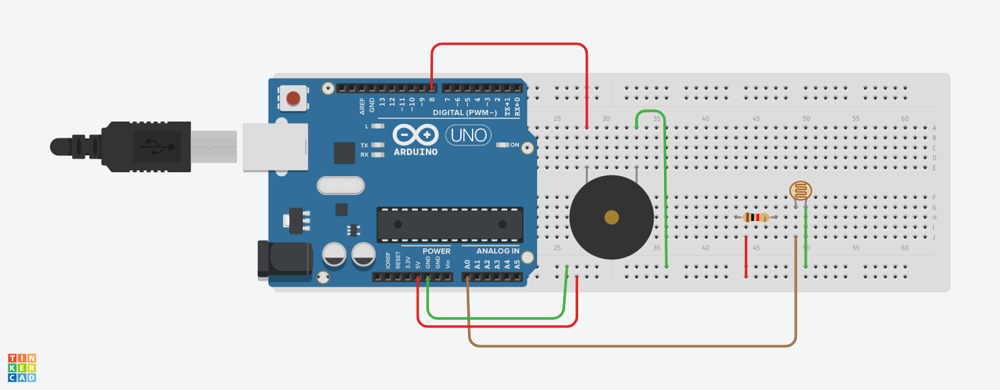
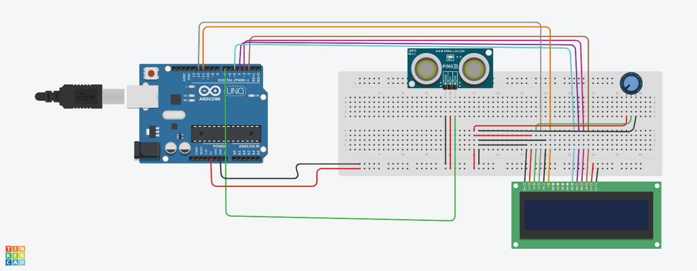
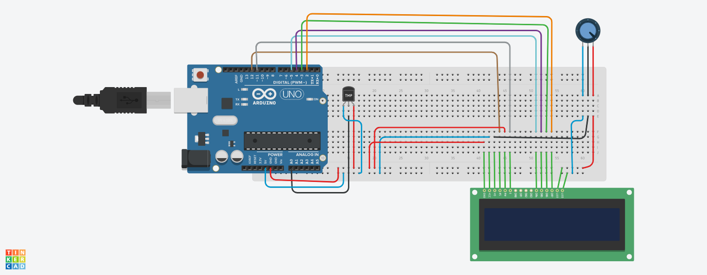
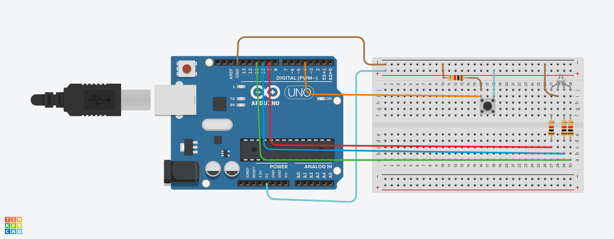
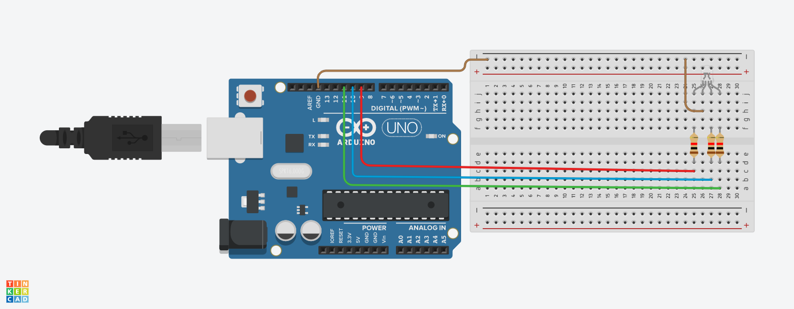
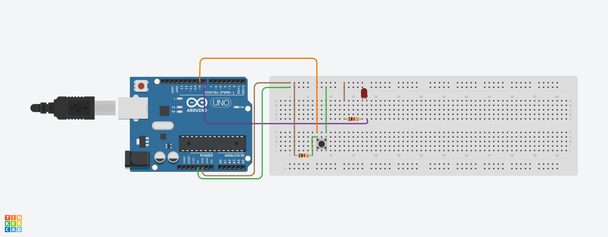

# Arduino-Project-Example-Tinkercad

<h3>Sosyal_Mesafe_Uyarı_Sistemi</h3>

<h3>Deney-7-Sesli_İkaz_Uygulaması</h3>

<h3>Deney-6-Mesafe_Sensörü</h3>

<h3>Deney-5-Sıcaklık_Ölçümü</h3>

<h3>Deney-4_butonla-RGBLED</h3>

<h3>Deney-3-RGB_led_kontrolü</h3>

<h3>Deney-2-Buttonla-Led_Yakma</h3>

<h3>Deney-1-led yakma</h3>

